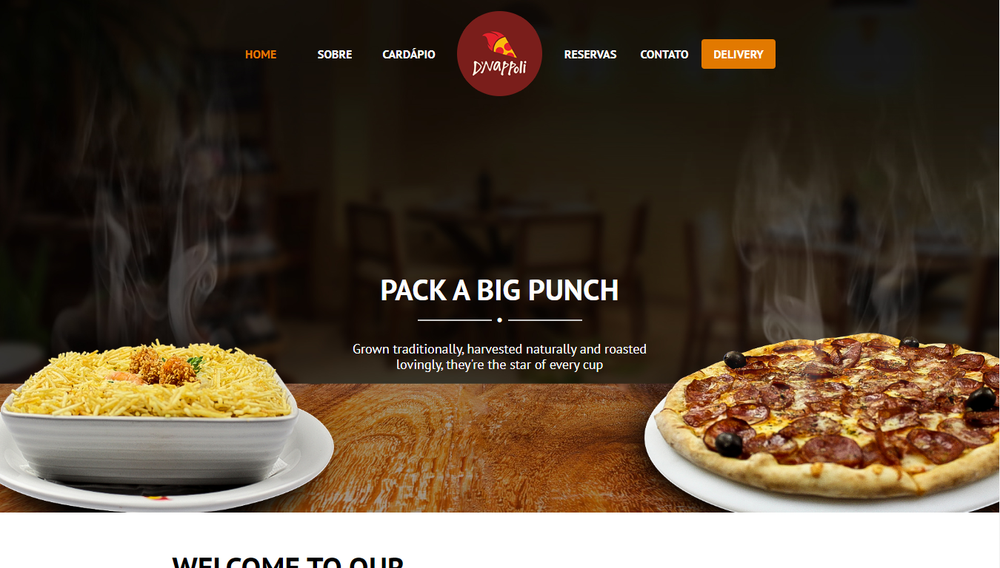

    

 

 

  <a href="#tecnologias">Tecnologias</a>
  &nbsp;&nbsp;&nbsp;|&nbsp;&nbsp;&nbsp;
  <a href="#projeto">Projeto</a>

 
 

    

<h2 title='#tecnologias'>
    Tecnologias
</h2>

Esse projeto foi desenvolvido com as seguintes tecnologias:

- Html5
- Css3
- Javascript
- Bootstrap 4

<h2 title='#projeto'>
    Projeto
</h2>

Este é o site institucional da D’Nappoli, Pizzaria